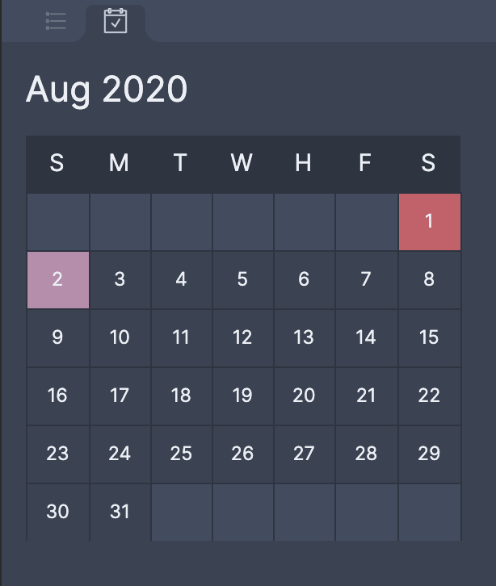

# Dragonglass

Dragonglass is a collection of scripts and themes used to power my [Obsidian](http://obsidian.md) workflow. Note, everything here is very Work-In-Progress and likely only works on my own computer!

## Instructions

### Volcano Plugins

> These require Volcano to be installed and setup on your computer to run. Install instructions can be [found here](https://github.com/kognise/volcano#installation).

The Volcano plugins are written in ES6, so you'll need to transpile them with babel before you can drop them into your Volcano plugins directory.

```
$ cd <dragonglass_dir>/volcano_plugins
$ npm install
$ npm run build
```

```
$ ln -s <dragonglass_dir>/volcano_plugins/build ~/volcano/plugins/
```

(better install instructions Coming Soon:tm:)

## Contents

### [Volcano](https://github.com/kognise/volcano) Plugins

#### Calendar

A widget that shows a calendar view of the current month. Select a day to view that day's daily note.

More features to come soon.



#### **[WIP]** Daily Notes (with dynamic templates)

Based on the existing "Daily Note" plugin in Obsidian, but it renders the template with [Handlebars](https://handlebarsjs.com/). This allows for dynamic content within the template, such as timestamps.

### Scripts

#### `daily-note-template.py`

A script used in conjunction with Keyboard Maestro to create a new daily note if one doesn't exist. It supports dynamic content.

#### `markdown-calendar.py`

Insired by this [Obsidian forum post](https://forum.obsidian.md/t/calendar-and-tasks-for-daily-notes/3218), the markdown-calendar creates a calendar view autofilled with the daily notes that you have in your vault. I have it configured to regenerate whenever Obsidian regains focus.

#### `format-date-files.py`

A crude script for migrating all my Bear notes in the format of `Month Day, Year.md` into `YYYY-mm-dd.md`.

### Theme(s)

#### Ulfric

A modified version of the [Nord Theme](https://www.nordtheme.com/) with added visual niceties (and hacks).
